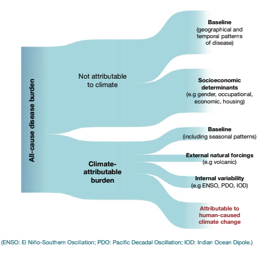

# Creating a Counterfactual for a Health Impact Attribution Study

**Detection and Attribution (D&A)** methods are a set of methodological approaches designed to disentangle the role of anthropogenic forcing in climate dynamics.

The field of detection and attribution grapples the core challenges of:
1. Detecting changes in the planet’s climate
2. Distinguishing these changes from natural internal variability (noise)
3. Attributing these changes to the relative contribution of various forcings 
4. Understanding how today’s earth system would be different in the absence of anthropogenic forcing.

  

D&A has shifted to focus on several sectors of interest e.g., energy, agriculture

Due to the growing evidence that climate change poses a threat to human health, detecting and attributing human health impacts caused by climate change (termed **health impact attribution, HIA**), has become an emerging interdisciplinary field in the last decade.

Why attribute health impacts to climate change: 
- Providing further evidence on the impact of anthropogenic climate change, highlighting the need for climate action 
- Better understand changing transmission dynamics
- Guide mitigation and resource allocation

  

The repository is designed to take you through **developing your own counterfactual for health impact attribution modelling**, rather than using pre-defined datasets such as ISIMIP and DAMIP. 

The tutorial should be followed using the main R quarto file "developing_a_counterfactual.qmd". 

The repository is structured into a main markdown/quarto file, which takes you through the full tutorial, along with several folders which contain data and additional exercises: 
1. **climate**: Includes a small sample of climate data to run some of the analysis, including temperature, relative humidity and precipitation data 
2. **drivers**: Has a file labled "raw" with the original emissions and concentraionts files, along with a clean concentrations and emissions dataset and a script which takes you through the cleaning process and provides more details on climate drivers and possible data sources.
3. **extremes**: Contains a script for simulating an extremes dataset, in this case heatwaves along with the simulated data, and the additional data generated through the SWG explored in the repository. There is a script which includes an additionaly, more complex SWG that the one explored in the markdown. 
4. **gmta**: Includes the chosen raw GMTA dataset used here (Berkley)

Topics explored in the tutorial include: 

**Trend counterfactuals**
- Detrending 
- ATTRICI & Linear-based residual detrending
- GMTAs 
- Non-linear residual-based detrending, including loess, splines and GAMs
- Counterfactuals without GMTAs
- Singular Spectrum Analysis 
- Empirical Mode Decomposition 
- Non-temperature counterfactuals & using GMTAs as a forcing proxy
- Incorporation of drivers and emissions 

**Event counterfactuals**
- Counterfactuals without the event 
- Fourier regression 
- Linear time interpolation 
- Worlds with differing events 
- Qualitative storylines 
- Counterfactuals based on empirical atmospheric thermodynamics
- Stocastic weather generators 

**Ensembling & incorporating a boostrap**

This is by no means an exhaustive list, but gives many options depending on the health outcome, climate variables of interest, spatial and temporal scales, and what you want to infer from your analysis.

**Developer**: Gina E C Charnley
