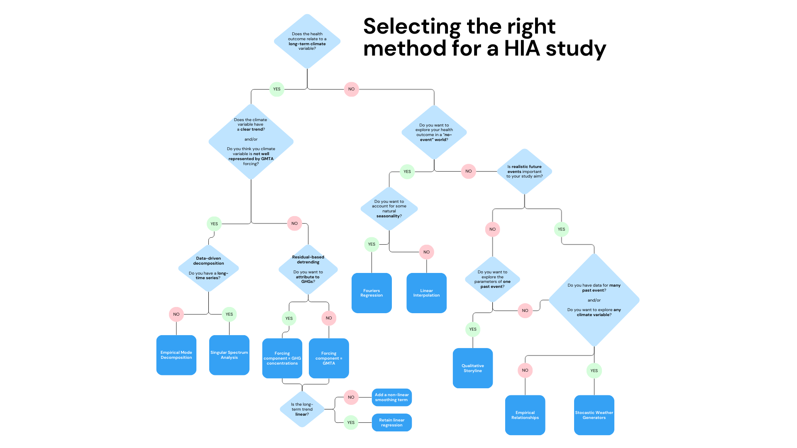

# Exploring Counterfactual Climates for Health Impact Attribution Studies

**Detection and Attribution (D&A)** methods are a set of methodological approaches designed to disentangle the role of anthropogenic forcing in climate dynamics.

The field of detection and attribution grapples the core challenges of:
1. Detecting changes in the planet’s climate
2. Distinguishing these changes from natural internal variability (noise)
3. Attributing these changes to the relative contribution of various forcings 
4. Understanding how today’s earth system would be different in the absence of anthropogenic forcing.

D&A has shifted to focus on several sectors of interest e.g., energy, agriculture

Due to the growing evidence that climate change poses a threat to human health, detecting and attributing human health impacts caused by climate change (termed **health impact attribution, HIA**), has become an emerging interdisciplinary field in the last decade.

Why attribute health impacts to climate change: 
- Providing further evidence on the impact of anthropogenic climate change, highlighting the need for climate action 
- Better understand changing transmission dynamics
- Guide mitigation and resource allocation

The repository is designed to take you through **developing your own counterfactual for health impact attribution modelling**, rather than using pre-defined datasets. 

The tutorial should be followed using the main R quarto file "01_developing_a_counterfactual.qmd". 

The repository is structured into a main markdown/quarto file, which takes you through the full tutorial, along with several folders which contain data and additional exercises: 
1. **02_synthetic_climate_data_generation**: Generates the synthetic climate data used to explore the methods in the tutorial. 
2. **03_gmta_processing**: Includes the script to process the raw GMTA dataset used here (Berkley Earth) and the clean data
3. **04_ghg_concentrations_processing**: A clean concentrations dataset and a script which takes you through the cleaning process and provides more details on greenhouse gas concentrations and possible data sources.

Topics explored in the tutorial include: 

**Climate Trend Counterfactuals**
- Detrending 
- ATTRICI & Linear-based residual detrending
- GMTAs 
- Non-linear residual-based detrending, including loess, splines and GAMs
- Counterfactuals without GMTAs
- Singular Spectrum Analysis 
- Empirical Mode Decomposition 
- Non-temperature counterfactuals 
- Incorporation of greenhouse gas concentrations

**Climate Event Counterfactuals**
- Counterfactuals without the event 
- Fourier regression 
- Linear time interpolation 
- Worlds with differing events 
- Qualitative storylines 
- Counterfactuals based on empirical atmospheric thermodynamics
- Stocastic weather generators 

**Ensembling & incorporating a boostrap**

We have explored several methodologies and while we hope some users may use our tutorial to deepen their understanding, we anticipate others may have specific climate data they want to explore counterfactuals for and the flow diagram provides a guide to user to the correct method for them. 

  

This is by no means an exhaustive list, but gives many options depending on the health outcome, climate variables of interest, spatial and temporal scales, and what you want to infer from your analysis.

**Developer**: Gina E C Charnley
